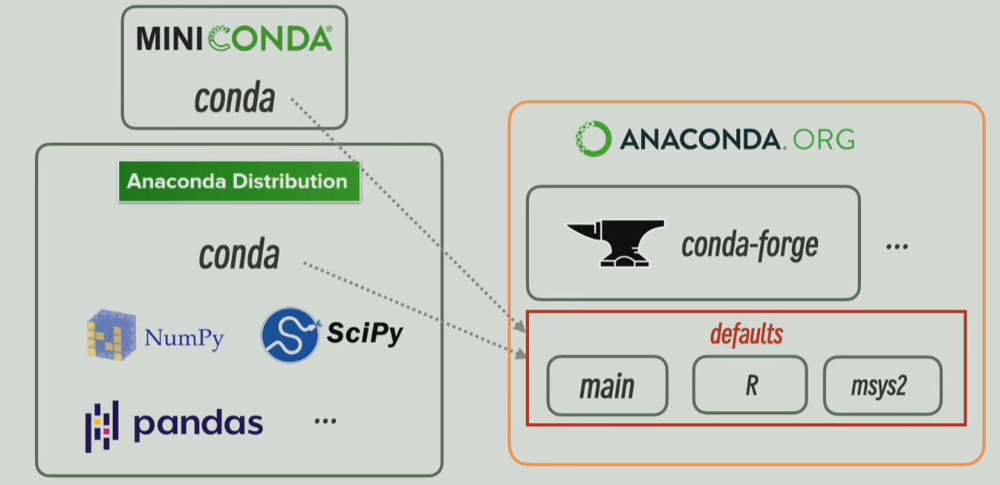

+++

title = "Anaconda 全家桶介绍"

date = "2025-08-09"

[taxonomies]

tags = ["Anaconda", "Python"]

+++

> 本笔记内容参考：[15分钟彻底搞懂！Anaconda Miniconda conda-forge miniforge Mamb](https://www.bilibili.com/video/BV1Fm4ZzDEeY)​

## Anaconda 系列

**Anaconda Distribution**：Anaconda Distribution 简称 Anaconda 包，就是我们在 Anaconda 官网上下载的安装包内容。其是使用 Python 编写的，提供了大量科学计算领域的二进制文件和 Python 库。

**Anaconda.org**：当 Anaconda 爆火后，显然官方维护的库已经不够大家使用了，因此 Anaconda 公司主动提供了一个 `anaconda.org`​ 平台供大家上传自己的库，并将自己原先整理的 `Anaconda Distribution`​ 放置在 `anaconda.org`​ 的 `defaults`​ 库 Channel 中。

**Miniconda**：随着 `anaconda.org`​ 的出现，大多数情况下我们不希望完整下载 `Anaconda Distribution`​，毕竟很多时候我们并不想用里面的包，而是只下载一个 `conda`​ 的包管理器，并从 `anaconda.org`​ 下载自己想用的包。因此 Anaconda 公司提供了 `miniconda`​ 工具，只最小程度满足 `conda`​ 的包管理器，而不去完整按照 `Anaconda Distribution`​。

**Mamba**：由于 `conda`​ 工具本身是用 Python 写的，其在计算依赖等情况下效率非常低，因此社区为了提高 `conda`​ 的性能，重新实现了那些耗时的模块，这种新实现被称为 Mamba。现在 `conda`​ 或者 `miniforge`​ 默认都使用 Mamba。

**注意**：一般安装包不要放在 `base`​环境中，因为 conda 工具本身运行于 `base`​ 环境，如果把 `base`​ 环境搞坏了则所有环境都毁了。

## Conda-Forge 系列

**Conda Forge**：随着 `Anaconda.org`​ 的出现，社区自发组织了一个名为 `conda forge`​ 的 channel，现在 `conda forge`​ 已经是更新最快，包内容最多，且完全免费的 channel 了。而 Anaconda 公司现在对商用 `defaults`​ channel 收费，因此越来越多人转向了 `conda forge`​。但是由于 `conda`​ 默认指向 `defaults`​ 的 channel，如果要使用 `conda forge`​需要在每个命令后面都加上 `-c conda-forge`​。

**MiniForge**：由于 `Anaconda`​ 和 `Miniconda`​ 都默认指向 `defaults`​ 的 channel，因此社区基于 `conda`​ 的开源程序重新开发了 `miniforge`​ 以替代 `miniconda`​，并且默认均指向 `conda-forge`​。（但是其实只需要习惯于使用 `environment.yml`​ 指定 `channels`​ 就可以）

**注意**：现在 `conda-forge`​ 的兼容性以及包的数量已经被视为超过 `defaults`​ channel，因此在实际项目中强烈建议只使用 `conda-forge`​ channel 并且不要使用 `defaults`​。几乎唯一的特殊情况是要安装特殊优化的包，例如 `mkl`​。

## Environment.yml

‍
