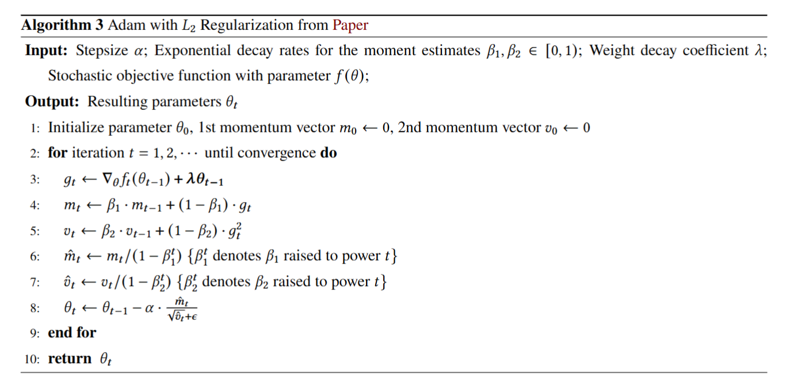
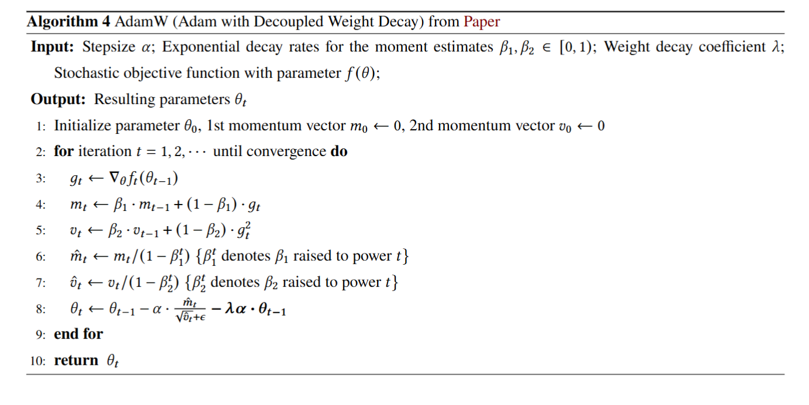

+++

title = "AdamW: Adam with Decoupled Weight Decay"

date = "2025-08-27"

[taxonomies]

tags = ["Optimization", "Machine Learning"]

+++

AdamW 是对 Adam 的改进版，Adam 在处理 Weight Decay 时存在一些问题，而 AdamW 正解决了该问题。

---

## L2 Regularization 与 Weight Decay

**L2 Regularization 的定义**：给定原始损失函数 $f$，使用 L2 Regularization 的优化器<u>修改了损失函数</u>为

$$
f_{\text{total}} (\theta) = f(\theta) + \frac{\lambda}{2}\|\theta\|_2^2.
$$

其中 $\theta$ 表示模型中的权重参数（一般不包含偏置项 biases），$\|\theta\|_2^2$ 是 $\theta$ 的 L2 范数平方。当我们对其求梯度可以得到其在 SGD 中的更新格式

$$
\nabla f_{\text{total}}(\theta)=\nabla f(\theta)+\lambda\theta 
\quad \Rightarrow \quad 
\theta_{t+1}=(1-\eta\lambda)\theta_t-\eta \nabla f(\theta).
$$

**Weight Decay 的定义**：带 Weight Decay 的优化器<u>修改了梯度更新规则</u>为

$$
g = \nabla f(\theta) + \lambda \theta,
$$

同理我们可以得到其在 SGD 中的参数更新格式：

$$
\theta_{t+1}=(1-\eta\lambda)\theta_t-\eta \nabla f(\theta)
$$

**L2 Regularization 与 Weight Decay 的等价性**：从上面的推导可以看出，在 SGD 中 L2 Regularization 与 Weight Decay 是等价的。但是这一结论在 Adam 中并不成立。

**L2 Regularization 与 Weight Decay 的目的**：两个方法的根本目的是为了防止<u>模型参数过大而导致过拟合</u>（因为 L2 Regularization 损失函数中对大参数进行了惩罚），很多时候当模型参数过大时，其在训练数据上能表现得很好，但是在验证/测试数据上表现很差。

**L2 Regularization 与 Weight Decay 的区别**：虽然两者在 SGD 中等价，但是对大参数的惩罚的最根本原因是 L2 Regularization 中修改的损失函数。这也为 Adam 中的错误处理埋下了伏笔。

---

## Adam 中的 Weight Decay

**Adam 中的 Weight Decay 处理方式**：Adam 中 Weight Decay 的处理放在了梯度的计算上，即

$$
g_t \leftarrow \nabla_\theta f_t(\theta_{t-1}) + \lambda \theta_{t-1}.
$$

**Adam 中 Weight Decay 处理的问题**：Adam with L2 regularization 的最大错误就是

$$
\text{忽略了修改损失函数和修改更新规则的等价性}
$$

我们本质上是想要惩罚大参数，也就是实现 L2 Regularization 中的损失函数。而 Adam 延续了 SGD 的定式思维，认为 Weight Decay 中的更新格式就能实现 L2 Regularization 中的损失函数，而事实上 Adam 的自适应机制导致 Weight Decay 的格式被自适应步长所影响，达不到 L2 Regularization 格式的目标。

---

## AdamW 的格式

**AdamW 的改进**：AdamW 重新实现了原本 L2 Regularization 的目标，将 Weight Decay 从梯度中解耦，放到最后一步计算，从而提高了泛化性。

