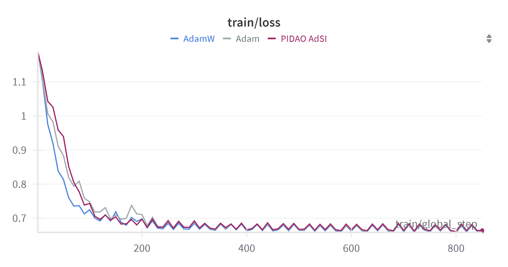

+++
title = "MAE 测试环境搭建"
date = "2025-07-29"

[taxonomies]
tags =  ["Machine Learning", "MAE", "Computer Vision"]
+++

## 背景

近期想将我们设计的优化器在 MAE + ViTs 预训练上进行测试，原本想用 `Hugging Face`​ 的 `transformers`​ 自带的 `run_mae.py`​ （见 [transformers/examples/pytorch/image-pretraining](https://github.com/huggingface/transformers/tree/main/examples/pytorch/image-pretraining)）进行测试，结果测试出来发现表现不是太好（不知道是不是我哪里搞错了）。比如在 CIFAR-10 上进行预训练，几个 Epoch （对应 200 个 global step） 后 train loss 就不下降了。

​

而 Facebook 的官方 `mae`​ 不带训练日志，而且环境有点儿过于古老了，装起来容易遇到各种 Bug。最后找到了 [pengzhiliang/MAE-pytorch](https://github.com/pengzhiliang/MAE-pytorch) 感觉可以用来测试一下，包含完整的训练日志。

## 准备数据集（ImageNet-1k）

我从 Hugging Face 官网下载了 ImageNet 数据集（见 [ILSVRC/imagenet-1k · Datasets at Hugging Face](https://huggingface.co/datasets/ILSVRC/imagenet-1k) ），国内下载速度不行的话可以尝试使用 `hf-mirror`​ 站点。下载完成内容如下：

```
test_images.tar.gz  train_images_0.tar.gz  train_images_1.tar.gz  train_images_2.tar.gz  train_images_3.tar.gz  train_images_4.tar.gz  val_images.tar.gz
```

> 如果使用 hugging face 的 `datasets`​ 库加载数据集则不需要自己手动处理 `tar.gz`​ 文件

训练集压缩包中的图片名称类似于 `n02974003_1569_n02974003.JPEG`​，其中 `n02974003`​ 是 class label，`1569`​ 是 image ID。验证集中的图片名称类似于 `ILSVRC2012_val_00027905_n02107908.JPEG`​ 。一般的程序读取 ImageFolder 会需要将数据集组织为以下格式

```bash
imagenet_structured/
├── n01440764/
│   ├── n01440764_10026.JPEG
│   └── ...
├── n02974003/
│   ├── n02974003_1569.JPEG
│   └── ...
└── ... (其他所有类别)
```

因此我们需要首先将数据集全部解压出来，然后写个脚本按类别分到不同子文件夹。

- 将所有图片解压到临时文件夹

```bash
mkdir imagenet1k
mkdir -p imagenet1k/flat_train imagenet1k/flat_val
# 执行解压脚本
for f in train_images_*.tar.gz; do
  tar -xzvf "$f" -C imagenet1k/flat_train/
done
tar -xzvf val_images.tar.gz -C imagenet1k/flat_val/
```

- 运行脚本整理文件结构，首先 `mkdir processed_data`​ 然后执行脚本

```bash
# --- 整理训练集 ---
echo "开始整理训练集结构..."
# 进入临时训练集文件夹
cd flat_train

# 遍历所有 .JPEG 文件，根据文件名创建目录并移动文件
for file in *.JPEG; do
  # 从文件名 'n02974003_1569_n02974003.JPEG' 中提取 'n02974003'
  class_name=$(echo "$file" | cut -d'_' -f1)
  
  # 在最终的目标目录 ../processed_data/train/ 中创建类别子文件夹
  mkdir -p "../processed_data/train/$class_name"
  
  # 将文件移动到新创建的目录中
  mv "$file" "../processed_data/train/$class_name/"
done

# 返回主目录
cd ..
echo "训练集整理完毕。"


# --- 整理验证集 ---
echo "开始整理验证集结构..."
# 进入临时验证集文件夹
cd flat_val


for file in *.JPEG; do
  # 从文件名末尾提取类别 (e.g., ILSVRC2012_val_..._n02107908.JPEG)
  class_name=$(echo "$file" | awk -F'[_.]' '{print $4}')
  mkdir -p "../processed_data/val/$class_name"
  mv "$file" "../processed_data/val/$class_name/"
done

# 返回主目录
cd ..
echo "验证集整理完毕。"
```

## 运行测试

- 首先下载代码

```
git clone https://github.com/pengzhiliang/MAE-pytorch.git
```

- 创建环境：由于 `requirements.txt`​ 中的包版本较老，使用新版 python 大概率装不了各种报错，我这里用 conda 创建一个 python=3.9 的环境，然后去 [Previous PyTorch Versions](https://pytorch.org/get-started/previous-versions/) 查看对应的 CUDA 版本。我也提供了 `environment.yml`​ 可直接更新环境（我用的是 4090）：

```bash
name: mae
channels:
  - pytorch
  - nvidia
  - conda-forge
  - defaults
dependencies:
  - python=3.9
  - pytorch::pytorch=1.8.1
  - pytorch::torchvision
  - pytorch::pytorch-cuda=11.8
  - pip
  - pip:
    - timm==0.4.12
    - Pillow
    - blobfile
    - mypy
    - numpy<2.0
    - pytest
    - requests
    - einops
    - tensorboardX
    - scipy
```

- 新建一个 `run.sh`​ 辅助执行

```bash
# Set the path to save checkpoints
OUTPUT_DIR='output/pretrain_mae_base_patch16_224'
# path to imagenet-1k train set
DATA_PATH='/path/to/ImageNet_ILSVRC2012/train'


# batch_size can be adjusted according to the graphics card
OMP_NUM_THREADS=1 python -m torch.distributed.launch --nproc_per_node=8 run_mae_pretraining.py \
        --data_path ${DATA_PATH} \
        --mask_ratio 0.75 \
        --model pretrain_mae_base_patch16_224 \
        --batch_size 128 \
        --opt adamw \
        --opt_betas 0.9 0.95 \
        --warmup_epochs 40 \
        --epochs 1600 \
        --output_dir ${OUTPUT_DIR}
```

- 执行 `./run.sh`​ 成功运行程序

```bash
$ ./run.sh                                                                                                                                                                                     (mae) 
optimizer settings: {'lr': 7.5e-05, 'weight_decay': 0.0, 'eps': 1e-08, 'betas': [0.9, 0.95]}
Use step level LR & WD scheduler!
Set warmup steps = 122600
Set warmup steps = 0
Max WD = 0.0500000, Min WD = 0.0500000
Auto resume checkpoint: 
Start training for 1600 epochs
[W reducer.cpp:1050] Warning: find_unused_parameters=True was specified in DDP constructor, but did not find any unused parameters. This flag results in an extra traversal of the autograd graph every iteration, which can adversely affect performance. If your model indeed never has any unused parameters, consider turning this flag off. Note that this warning may be a false positive your model has flow control causing later iterations to have unused parameters. (function operator())
Epoch: [0]  [   0/3065]  eta: 3:59:19  lr: 0.000000  min_lr: 0.000000  loss: 1.6757 (1.6757)  loss_scale: 65536.0000 (65536.0000)  weight_decay: 0.0500 (0.0500)  grad_norm: 2.4795 (2.4795)  time: 4.6849  data: 3.0511  max mem: 6911
Epoch: [0]  [  10/3065]  eta: 0:34:19  lr: 0.000000  min_lr: 0.000000  loss: 1.6727 (1.6722)  loss_scale: 65536.0000 (65536.0000)  weight_decay: 0.0500 (0.0500)  grad_norm: 2.4795 (2.4770)  time: 0.6740  data: 0.3446  max mem: 8010
Epoch: [0]  [  20/3065]  eta: 0:23:12  lr: 0.000000  min_lr: 0.000000  loss: 1.6720 (1.6713)  loss_scale: 65536.0000 (65536.0000)  weight_decay: 0.0500 (0.0500)  grad_norm: 2.4731 (2.4757)  time: 0.2458  data: 0.0447  max mem: 8010
Epoch: [0]  [  30/3065]  eta: 0:19:40  lr: 0.000000  min_lr: 0.000000  loss: 1.6711 (1.6712)  loss_scale: 65536.0000 (65536.0000)  weight_decay: 0.0500 (0.0500)  grad_norm: 2.4731 (2.4737)  time: 0.2321  data: 0.0290  max mem: 8010
Epoch: [0]  [  40/3065]  eta: 0:17:55  lr: 0.000000  min_lr: 0.000000  loss: 1.6698 (1.6707)  loss_scale: 65536.0000 (65536.0000)  weight_decay: 0.0500 (0.0500)  grad_norm: 2.4698 (2.4723)  time: 0.2486  data: 0.0466  max mem: 8010
Epoch: [0]  [  50/3065]  eta: 0:20:32  lr: 0.000000  min_lr: 0.000000  loss: 1.6684 (1.6703)  loss_scale: 65536.0000 (65536.0000)  weight_decay: 0.0500 (0.0500)  grad_norm: 2.4694 (2.4712)  time: 0.4394  data: 0.2366  max mem: 8010
Epoch: [0]  [  60/3065]  eta: 0:21:06  lr: 0.000000  min_lr: 0.000000  loss: 1.6665 (1.6693)  loss_scale: 65536.0000 (65536.0000)  weight_decay: 0.0500 (0.0500)  grad_norm: 2.4636 (2.4694)  time: 0.5570  data: 0.3525  max mem: 8010
Epoch: [0]  [  70/3065]  eta: 0:21:11  lr: 0.000000  min_lr: 0.000000  loss: 1.6646 (1.6685)  loss_scale: 65536.0000 (65536.0000)  weight_decay: 0.0500 (0.0500)  grad_norm: 2.4563 (2.4678)  time: 0.4655  data: 0.2640  max mem: 8010
```

附上跑了 6 个 Epoch 的学习曲线

​

‍
