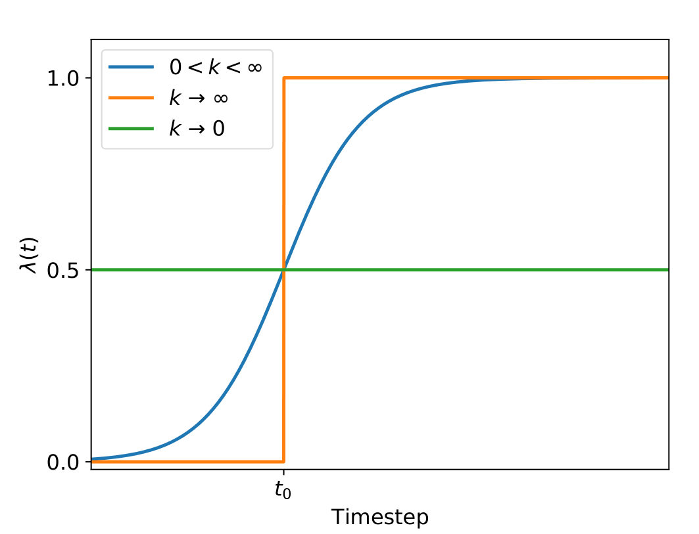
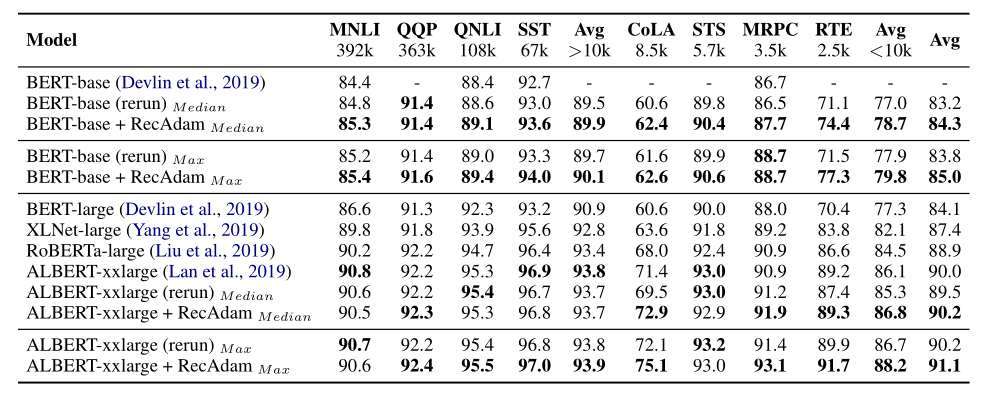
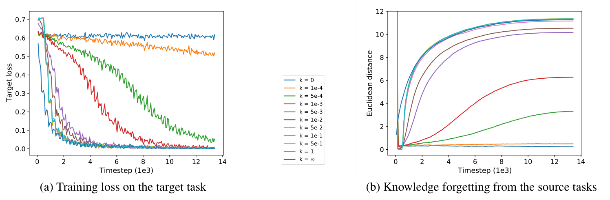

+++

title = "论文阅读-Recall and Learn Fine Tuning with Less Forgetting"

date = "2025-08-28"

[taxonomies]

tags = ["Fine Tuning", "Catastrophic Forgetting", "Machine Learning"]

+++

> Original Paper: [[2004.12651] Recall and Learn: Fine-tuning Deep Pretrained Language Models with Less Forgetting](https://arxiv.org/abs/2004.12651)

---

## Introduction

**Sequential Transfer Learning**: Pretrain a language model on large-scale unlabeled data and then adapt it to downstream tasks. The adaptation step is usually conducted in two manners: <u>fine-tuning</u> or <u>freezing pretrained weights</u> (e.g., train an additional classification head).

**Catastrophic Forgetting**: Such a sequential transfer learning paradigm often confronts the catastrophic forgetting problem, where a model forgets previously learned knowledge and overfits to target domains.

**Multi-task Learning**: Learns multiple tasks simultaneously to avoid catastrophic forgetting.

- Elastic Weight Consolidation (EWC): EWC evaluates the importance of each weight by <u>Fisher information matrix</u>, and punish the change on these important weights when adapting on subsequent tasks.

**Challenge in LLM Fine-Tuning**: Multi-task learning methods cannot be directly applied to the sequential transferring regime of deep pretrained LMs.

- Multi-task learning methods require to use data of pretraining tasks during adaptation.
- We only care about the performance of the downstream task, while multi-task learning also aims to promote performance on pretraining tasks.

---

## Contribution of This Work

**Recall and Learn Mechanism**: We propose a recall and learn mechanism, which adopts the idea of multi-task learning and jointly learns pretraining tasks and downstream tasks.

- Pretraining Simulation: recall the knowledge from pretraining tasks <u>without data</u>.
- Objective Shifting: focus the learning on downstream tasks gradually.

**Recall Adam (RECADAM)** : We provide RECADAM to integrate the recall and learn mechanism into Adam optimizer.

---

## Methodology

**Pretraining Simulation**: We introduce Pretraining Simulation to approximate the optimization objective of source tasks as a quadratic penalty. The learning objective on the source tasks $\text{Loss}_S$ is approximately

$$
\text{Loss}_S \approx \frac{1}{2}\gamma \sum_i (\theta_i - \theta_i^\ast)^2,
$$

where $\theta^\ast$ is the pretrained parameter, and $\gamma$ is a constant.

**Objective Shifting**: We introduce Objective Shifting to allow the objective function to gradually shift to $\text{Loss}_T$ with the annealing coefficient. The loss function with annealing coefficient is

$$
\text{Loss} = \lambda(t) \text{Loss}_T + (1 - \lambda(t)) \text{Loss}_S.
$$

Specifically, $\lambda(t)$ is calculated as the sigmoid annealing function:

$$
\lambda(t)=\frac{1}{1+\exp(-k\cdot(t-t_0))}.
$$

​

**RecAdam Optimizer**: We introduce RecAdam to integrate the quadratic penalty (Pretraining Simulation) and annealing coefficient (Objective Shifting). The difference between Adam and RecAdam lies in decoupling the quadratic penalty and annealing coefficient in Adam optimizer. In vanilla Adam, both the quadratic penalty and annealing coefficient would be adapted by the gradient update rules.

 refers to the preceduer (e.g., warm-up technique) to get the scaling factor of the step size.")

---

## Experiments

**Set up**​

- **Model**: BERT and ALBERT;
- **Data**: General Language Understanding Evaluation (GLUE), it includes 9 tasks.
- **Implementation**: Our methods use <u>random initialization</u> (do not load the pretrained paramters) while vanilla fine-tuning initializes the fine-tuning model with pretrained parameters.
- **Hyper-Parameters**: We set $\gamma$ to $5000$, select the best $t_0$ and $k$ in $\{100, 250, 500, 1000\}$ and $\{0.05, 0.1, 0.2, 0.5, 1\}$ respectively for the annealing coefficient $\lambda(t)$.

**Results on BERT-Base**: We outperform the vanilla fine-tuning method on $7$ out of $8$ tasks, especially on the tasks with smaller training data (<10k). It is interesting to find that compared to the median results with BERT-large model, we can also achieve better results on more than half of the tasks.

**Results on ALBERT-xxlarge**: We outperform the vanilla fine-tuning method on 5 out of 8 tasks of the GLUE benchmark.

**Initialization Analysis**: RECADAM, with both initialization strategies, can outperform the vanilla fine-tuning method on all the four tasks. Random initialization would be our choice because the model would benefit from a larger parameter search space.

 and Random Initialization (RI). We report median over 5 runs.")

**Forgetting Analysis**: The hyper-parameter $k$ controls the rate of the objective shifting

- Target Loss: With larger k, the model converges quickly on the target task.
- Source Loss: We measure the pre-trained knowledge forgetting by the Euclidean distance between $\theta_0$ and $\theta$. At the very early stage, the distance drops sharply because of the random initialization and pre-trained knowledge recalling. As the objective rate $k$ decreases, we find that the model can achieve less forgetting at the end of the fine-tuning.

---

‍
